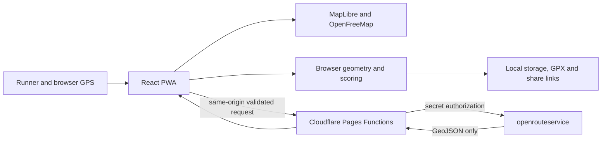

# LoopRoute

LoopRoute is a mobile-first progressive web app that creates approximately circular running routes from a chosen start. It asks for the current GPS position, requests up to three free pedestrian round trips, ranks them for distance accuracy and low repetition, and supports GPX export, reproducible privacy-aware links, and basic live following.

The app has no accounts, analytics, database, cookies, paid map provider, or server process. It is designed for Cloudflare Pages, OpenFreeMap, OpenStreetMap-derived data, and the free openrouteservice API.

## Live deployment

[Open LoopRoute](https://looproute.pages.dev). The production site is connected to this repository through Cloudflare Pages; every commit to `main` is built, tested by the deployment pipeline, and published automatically.

## What is included

- Full-viewport MapLibre map using the public OpenFreeMap Liberty/Dark styles and visible attribution
- GPS-first start selection with search, draggable marker, explicit map mode, long press, and last-start fallback
- 3 km through marathon presets, 1-100 km custom distances, kilometres/miles, and local running pace
- Road, mixed, and trail-friendly routing preferences plus an avoid-steps preference
- Three seeded candidates, at most two bounded initial replacements, deduplication, and one-call “Generate another”
- Route cards with actual distance, target difference, estimated run time, ascent, surfaces, repetition estimate, warnings, and score
- Elevation profile, turn list, GPX 1.1 export, Web Share/clipboard fallback, and privacy-rounded links
- Live GPS following with completed/remaining estimates, distance-to-route warning, map-follow toggle, and wake lock
- English and natural Swedish interfaces, light/dark/system themes, offline shell and last-route behavior
- Thin validated Cloudflare Pages Functions for route, geocode, and health endpoints
- Unit, component, Function, and Playwright browser tests

Road, mixed, and trail-friendly are preferences, not surface or access guarantees. Repetition is an approximation based on 20 m resampling and an 18 m projected grid. Route suggestions never establish safety or legal access.

## Architecture



Global pedestrian routing requires a maintained routing graph, so route computation stays with openrouteservice instead of attempting an impractical hobby-project graph. Route normalization, repeated-edge analysis, similarity, ranking, elevation fallback, GPX, and share generation run client-side to keep Functions within free-plan CPU limits and avoid server-side location storage. `RoutingProvider`, geocoding, and centralized map configuration isolate provider-specific behavior.

## Local setup

Requirements: Node.js 24 LTS or another Vite-supported Node release, npm, and a free [openrouteservice API key](https://openrouteservice.org/dev/#/signup).

```bash
npm install
cp .dev.vars.example .dev.vars
# Edit .dev.vars and set ORS_API_KEY
npm run dev
```

`npm run dev` serves the frontend only; browser route calls need a mocked API or the Cloudflare workflow below. Never put `ORS_API_KEY` in `.env`, frontend variables, HTML, or committed files.

For a full local Pages environment:

```bash
npm run dev:cloudflare
```

That command produces `dist` and runs `wrangler pages dev dist`, including the Functions and `.dev.vars`. Re-run it after frontend changes. Check [http://localhost:8788/api/health](http://localhost:8788/api/health); it returns only reachability and whether the key is configured.

## Commands

| Command                             | Purpose                                                         |
| ----------------------------------- | --------------------------------------------------------------- |
| `npm run dev`                       | Vite frontend development                                       |
| `npm run build` / `npm run preview` | Production build and local preview                              |
| `npm run dev:cloudflare`            | Built frontend plus Pages Functions                             |
| `npm run typecheck`                 | Strict TypeScript checks                                        |
| `npm run lint`                      | ESLint                                                          |
| `npm run format` / `format:check`   | Prettier write/check                                            |
| `npm test` / `test:watch`           | Vitest unit, component, and pure Function tests                 |
| `npm run test:e2e`                  | Mocked-provider Playwright flows on mobile and desktop Chromium |
| `npm run verify`                    | Typecheck, lint, tests, and production build                    |

Playwright does not call the live routing provider. Install its browser once with `npx playwright install chromium`.

## Route generation and scoring

An initial action creates three cryptographic positive seeds and makes three concurrent same-origin route calls. Only a failure, a route beyond 5%, or a near-duplicate can trigger a replacement, with two additional calls maximum. “Generate another” makes exactly one call and replaces the lowest-ranked unselected card.

Routes are resampled to no more than 12,000 points at approximately 20 m, projected locally, and quantized into 18 m cells. Directed and undirected repeated transitions are measured; card UI uses the undirected percentage. Reverse traversal of the same physical edges is included in the Jaccard duplicate check. The stable score is 35% distance, 40% repetition, 10% closure, and 15% compactness. These approximations can be imperfect in dense paths, bridges, switchbacks, or sparse map data.

## Privacy and security

- Precise coordinates, the last selected route, settings, and safety dismissal stay in versioned browser storage. Only one route is retained.
- Live positions and search history are never stored. Clearing local data removes all LoopRoute browser state.
- Default share links round the start to three decimals (roughly 100 m). Precise sharing is explicit and warns about revealing a home or hotel.
- `/api/route` accepts only exact validated fields and a small JSON body. Functions restrict methods, upstream hosts, profiles, and distances; they never accept a user-controlled URL.
- API responses use `Cache-Control: no-store`; the service worker uses `NetworkOnly` for all `/api/*` requests.
- Cloudflare security headers restrict scripts, connections, frames, permissions, and map origins. The browser never contacts openrouteservice directly.
- No request body, coordinates, search text, API key, or authorization header is logged by application code.

Run `npm audit` when dependencies change. No actual secret is included in the repository.

## Cloudflare Pages deployment

1. Create a free openrouteservice account and API key.
2. Create a free Cloudflare Pages project and connect this repository, or upload it with Wrangler.
3. Set the build command to `npm run build` and output directory to `dist`.
4. In both Preview and Production project settings, add `ORS_API_KEY` as an encrypted secret.
5. Deploy; no custom domain is required.
6. Open `/api/health` and confirm `{"ok":true,"routingConfigured":true}` without any key value.
7. Test the geolocation permission on the HTTPS Pages URL.
8. Generate a mocked or real route and confirm the OpenFreeMap/OpenStreetMap attribution remains visible and browser CSP has no unexpected violations.

For a direct authorized upload, authenticate Wrangler and use `npx wrangler pages deploy dist --project-name looproute` after `npm run build`. CI intentionally does not deploy because no deployment credentials are assumed.

## PWA and offline behavior

The service worker precaches the application shell, hashed assets, and local icons. Routing, geocoding, and precise API responses are never cached. A previously visited app can reopen offline and show its last selected route; generation and search are disabled. Basemap availability depends on normal provider/browser caching and is not promised. There is no bulk map downloader.

## Attribution

Map rendering is MapLibre GL JS. Map style/tiles are OpenFreeMap/OpenMapTiles with data from OpenStreetMap contributors. Routing and geocoding are openrouteservice. Attribution stays visible on the map and is repeated in Settings. The project is MIT licensed; data and services retain their respective licenses and terms.

## Known limitations and troubleshooting

- Free external services can change quotas, terms, coverage, or availability. An initial generation normally uses three calls, can use up to two bounded replacements, and each “Generate another” uses one call.
- Shared routes are reproducible plans rather than stored geometry. They may change when coordinates are rounded, or when routing/map behavior changes.
- Elevation, surfaces, stairs, quietness, greenness, access, and trail quality depend on provider and OpenStreetMap coverage. The app never calls a route “safe.”
- **Missing key / 503:** create `.dev.vars`, restart Wrangler, or add the encrypted Pages secret.
- **401/403:** verify the openrouteservice key and account access; the client receives a safe configuration error.
- **429:** the free quota is busy or exhausted. Wait rather than repeatedly retrying.
- **Location denied:** use submitted place search, Set start on map, long press, or drag the marker. GPS requires HTTPS outside localhost.
- **Blank map / CSP errors:** verify access to `tiles.openfreemap.org`, inspect blocked origins, and keep `_headers` synchronized with the chosen style host.
- **No routes:** try a shorter distance, different mode, or nearby routable start. Islands, ferries, borders, and sparse footpath data can constrain loops.
- **Function errors:** check `/api/health`, `wrangler pages dev` output (which must not include request bodies), and Cloudflare Function logs without adding coordinate logging.

To replace routing, implement `RoutingProvider`, keep normalized route validation in the adapter, update the allow-listed Function destination, and preserve all quota/privacy tests.
